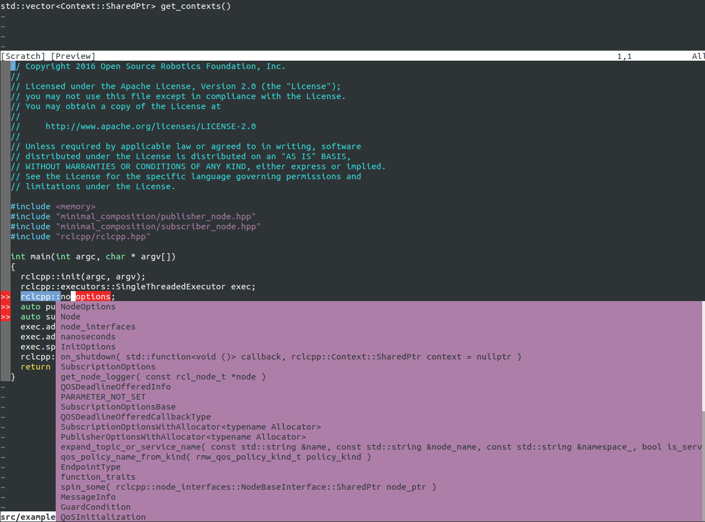
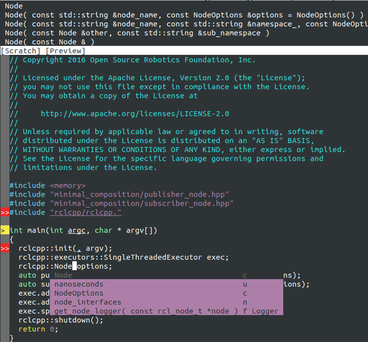

=================================================
ROS / ROS2 VIM Auto-Completion With YouCompleteMe
=================================================

.. contents:: Table of Contents
   :depth: 2

.. _install-ycm:

---------------------
Install YouCompleteMe
---------------------

I recommend installing YCM using `Vundle <https://github.com/VundleVim/Vundle.vim>`_.
However, the installation cannot be completed through a simple ``:PluginInstall`` in vim.

If you **already has Vundle installed**, skip ahead to the `Compile YCM section for Ubuntu` or `Windows`

.. _install-ycm-ubuntu:

Ubuntu
======

Install Vundle
--------------

#. **Requirement**

   Make sure you have ``vim`` and ``git`` installed.

#. **Setup** `Vundle <https://github.com/VundleVim/Vundle.vim>`_

   Simply clone the repository into the ``~/.vim/bundle`` directory.

   .. code:: bash

      git clone https://github.com/VundleVim/Vundle.vim.git \
                ~/.vim/bundle/Vundle.vim

#. **Enable Vundle**

   Put the following at the top of your ``~/.vimrc`` file.
   If this file does not exist, create a new empty file under the same name with the following content.

   .. code:: vim

      set nocompatible              " be iMproved, required
      filetype off                  " required

      " set the runtime path to include Vundle and initialize
      set rtp+=~/.vim/bundle/Vundle.vim
      call vundle#begin()
      " alternatively, pass a path where Vundle should install plugins
      "call vundle#begin('~/some/path/here')

      " let Vundle manage Vundle, required
      Plugin 'VundleVim/Vundle.vim'

      " All of your Plugins must be added before the following line
      call vundle#end()            " required
      filetype plugin indent on    " required
      " To ignore plugin indent changes, instead use:
      "filetype plugin on
      "
      " Brief help
      " :PluginList       - lists configured plugins
      " :PluginInstall    - installs plugins; append `!` to update or just :PluginUpdate
      " :PluginSearch foo - searches for foo; append `!` to refresh local cache
      " :PluginClean      - confirms removal of unused plugins; append `!` to auto-approve removal
      "
      " see :h vundle for more details or wiki for FAQ
      " Put your non-Plugin stuff after this line

Install YCM
-----------
#. **Requirement**

   The following setup is tested in Ubuntu 20.04,
   which contains ``vim-nox`` at ``v8.1.2269``.
   For more information on the system requirement on Ubuntu,
   please reference `the official documentation`__.

   .. __: https://github.com/ycm-core/YouCompleteMe#requirements

#. **Basic Installation**

   Add the following line into your the **Vundle** plugin part ``~/.vimrc``.

   .. code:: vim

      Plugin 'ycm-core/YouCompleteMe'

   The complete **Vundle** plugin part in your ``~/.vimrc`` should looks like the following.

   .. code:: vim

      ...
      call vundle#begin()
      Plugin 'VundleVim/Vundle.vim'

      Plugin 'ycm-core/YouCompleteMe'
      call vundle#end()
      ...

   After adding in the above code, run ``vim`` and type in ``:PluginInstall`` command.
   This will download the `YCM <ycm_>`_, as well as its submodules into the ``~/.vim/bundle/`` folder.
   Alternatively, you can use,

   .. code:: bash

      git clone --recursive https://github.com/ycm-core/YouCompleteMe

   .. _ycm: https://github.com/ycm-core/YouCompleteMe

   However, additional compilation is still needed first before using YCM.
   Otherwise you will get the following error: ::

     The ycmd server SHUT DOWN (restart with ':YcmRestartServer'). YCM core library not detected; you need to compile YCM before using it. Follow the instructions in the documentation.

   To compile YCM, run the following commands

   .. code:: bash

      cd ~/.vim/bundle/YouCompleteMe/
      python3 install.py --clang-completer

   For autocompletion with ROS, the ``--clang-completer`` option needs to be enable.

   Check out the official instructions for `how to configure more completer options`__,
   such as Java, go etc.

   .. __: https://github.com/ycm-core/YouCompleteMe#general-semantic-completion

#. **Installation Validation**

   After the compilation is completed, you should be able to test it with an empty ``.py`` file.

   The best way to test it is to try type in a file directory path.
   Upon successful installation you should get a similar result as the below image.

   .. image:: ./resource/ycm-successful-installation.png

   Skip to `customization <ycm-customization_>`_ and `ROS Configuration <ycm-ros-configuration_>`_ section if you primarily using the Windows YCM installation.

.. _install-ycm-windows:

Windows
=======

WIP

.. _ycm-ros-configuration:

-----------------
ROS Configuration
-----------------

No additional configuration is needed for **Python**,
as long as the library is included in the library ``PATH``.

However, for **C++**, additional compilation flags need to be passed to YCM.
This can be done through the ``compile_commands.json`` file, 
which can be generated at compilation time.

But catkin/colcon generate this file in the ``<path-to-workspace>/build`` directory,
and an additional `Python script`__ is needed to instruct YCM to look for the file in the correct directories.

.. __: .ycm_extra_conf.py

So first, navigate to the ROS workspace,
which should contain the ``build``, ``src`` and ``install`` folders,
and download the extra configuration.
Do remember to source the necessary dependencies or other workspaces if needed.

.. code:: bash

   cd <path-to-workspace>/
   curl -O https://raw.githubusercontent.com/Briancbn/ros_vim_autocomplete/master/.ycm_extra_conf.py

Next, based on the ROS builder tool that is used, use the following instructions to generate the ``compile_commands.json`` file.

CATKIN
======

If you are using ``catkin_make``, use the following command to generate and update the ``compile_commands.json`` file.

.. code:: bash

   catkin_make \
     -DCMAKE_EXPORT_COMPILE_COMMANDS=ON

If you are using ``catkin-tools``, you can configure the additional CMake arguments using the ``catkin config`` command.

.. code:: bash

   catkin config --cmake-args \
     -DCMAKE_EXPORT_COMPILE_COMMANDS=ON

and run ``catkin build`` again to generate the ``compile_commands.json`` file.

COLCON
======

Use the following command to generate and update the ``compile_commands.json`` file.

.. code:: bash

   colcon build --cmake-args \
     -DCMAKE_EXPORT_COMPILE_COMMANDS=ON

Validation
==========

Use ``vim`` to open a ROS / ROS2 ``.cpp`` or ``.hpp`` file,
you should be able to see something similar to the following image.

If you are not satisfied with the default style for the warning or the completion,
check out the `customization <ycm-customization_>`_ section.

Also checkout the `other tools <ycm-other-tools_>`_, for guide on further speeding up your development with **VIM**.

.. _ycm-customization:

-------------
Customization
-------------

Add in the following line to the end of the ``.vimrc`` file.
Below is my personal configuration

.. code:: vim

   " YCM settings
   let g:ycm_max_num_candidates = 5
   let g:ycm_warning_symbol = '>'
   let g:ycm_confirm_extra_conf = 0
   let g:ycm_add_preview_to_completeopt = 1
   let g:ycm_autoclose_preview_window_after_completion = 1
   let g:ycm_max_diagnostics_to_display = 0  " Reference: https://github.com/ycm-core/YouCompleteMe/issues/2392

   " YCM Error & Warning Color Scheme
   " https://jonasjacek.github.io/colors/
   hi YcmErrorSection ctermbg=0 cterm=underline
   hi YcmWarningSection ctermbg=0 cterm=underline

   " YCM Shortcut
   map g :YcmCompleter GoTo<CR>  " Go to definition

If you configure it the same way as I did,
you should have a similar looking style as below.

Let's go through the customization setting line-by-line.

.. code:: vim

   let g:ycm_max_num_candidates = 5

The number of options display in the drop down list.

.. code:: vim

   let g:ycm_warning_symbol = '>'

The symbol used on in the left column when there is a compilation warning for the line.

.. code:: vim

   let g:ycm_confirm_extra_conf = 0

This tells YCM to automatically load in the ``.ycm_extra_config.py`` file.
By default, there is a prompt to ask for confirmation.
It is rather inconvenient if you are using the ``.ycm_extra_config.py`` constantly.

.. code:: vim

   let g:ycm_add_preview_to_completeopt = 1
   let g:ycm_autoclose_preview_window_after_completion = 1

TODO(anyone): add explanation

.. code:: vim

   let g:ycm_max_diagnostics_to_display = 0

This will solve the **max diagnostics exceeded** warning if encountered.

.. code:: vim

   hi YcmErrorSection ctermbg=0 cterm=underline
   hi YcmWarningSection ctermbg=0 cterm=underline

Change the warning and error style to transparent background -- ``ctermbg=0``,
and underline ``cterm=underline``.

.. code:: vim

   map g :YcmCompleter GoTo<CR>

Change the hotkey for checking definition to ``g``.
Note that you can use ``Ctrl+o`` to go back to the original file.

.. _ycm-other-tools:

-----------
Other Tools
-----------